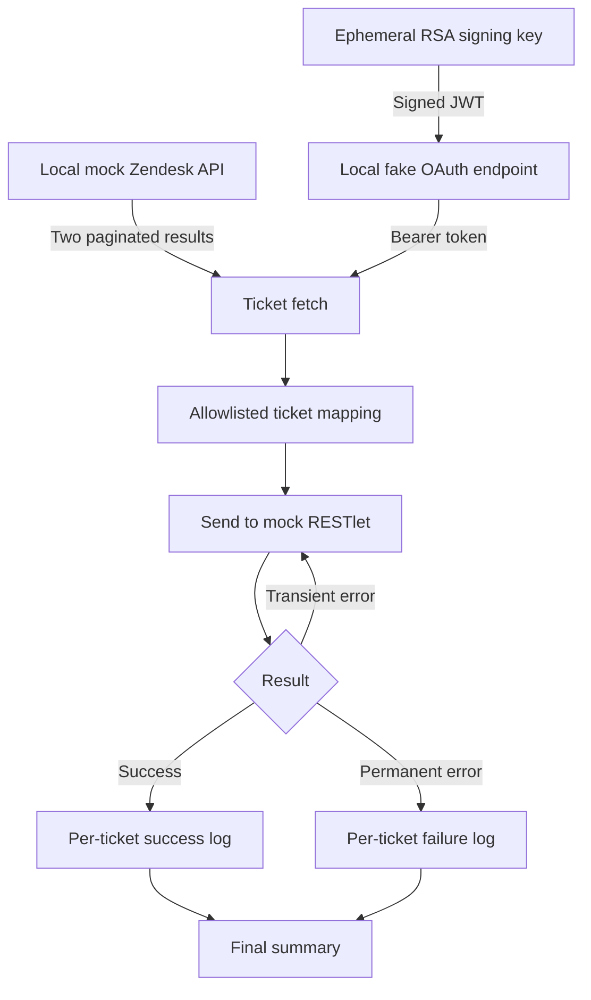

# Zendesk → RESTlet integration (local mock)

[](#tests) [](#architecture)

A **safe, original, AI-assisted portfolio demonstration** of a ticket integration. It simulates fetching paginated Zendesk tickets, creating a signed JWT client assertion, exchanging it for a bearer token, mapping **allowlisted** ticket fields, and sending records to a mock RESTlet with per-ticket logs and retry handling.

> This is **not** a production integration, a production NetSuite client or a drop-in live connector. The ticket data, endpoints, credentials and destination records are fictional. Every demo HTTP request goes to a local mock server. Never upload genuine employer scripts, private keys, credentials, customer records or internal endpoints.

## Quick start

**Requires:** Node.js 20+. No third-party packages or cloud accounts.

```bash
npm run demo
```

Expected result (IDs are dummy values):

```text
{"event":"tickets_fetched","count":4}
{"event":"authenticated","token_received":true}
{"event":"ticket_sent","zendesk_id":2001,"destination_record_id":"EXAMPLE-2001","attempts":1}
{"event":"ticket_sent","zendesk_id":2002,"destination_record_id":"EXAMPLE-2002","attempts":1}
{"event":"ticket_sent","zendesk_id":2003,"destination_record_id":"EXAMPLE-2003","attempts":2}
{"event":"ticket_failed","zendesk_id":2004,"status":400,"error":"RECORD_NOT_FOUND"}
{"event":"sync_complete","fetched":4,"sent":3,"failed":1}
```

The local mock deliberately generates a recoverable HTTP 503 for one ticket, and a permanent record-not-found error for another. The program records failures instead of treating every response as a successful batch.

## Architecture



The diagram simplifies execution order: ticket fetching is completed before token exchange in this demo.

## Engineering details

- **Pagination:** follows a fake `next_page` URL, checks that the origin is unchanged and guards against loops.
- **Authentication:** demonstrates cryptographically signed PS256 JWTs using Node's built-in crypto library. A disposable RSA key pair exists only in memory.
- **Data minimisation:** mapping explicitly includes only ID, subject, status, priority and update time. Dummy private notes and email addresses are discarded.
- **Resilience:** retries selected transient HTTP responses and records permanent RESTlet errors without crashing the whole sync.
- **Observability:** logs individual ticket outcomes and aggregate counts without printing secrets or entire ticket payloads.
- **No external calls:** the mock server binds to `127.0.0.1` on an ephemeral port.

The JWT claims and endpoint paths are educational examples. **A real NetSuite integration needs vendor-specific account configuration, certificates, claims, scopes, rate-limit handling and reviewed security controls.** This project deliberately doesn't provide a production connection or handle real credentials.

## Tests

```bash
npm test
```

The tests verify the JWT signature, safe ticket mapping, pagination, retry behaviour, and permanent-error handling against the local mock server.

## Layout

```text
src/auth.mjs             PS256 JWT signing
src/http.mjs             JSON request and HTTP error handling
src/clients.mjs          Paginated fetch, demo token exchange, RESTlet client
src/transform.mjs        Allowlisted field mapping
src/sync.mjs             Orchestration, retries, safe structured logs
mock/server.mjs          In-process fake Zendesk, OAuth and RESTlet services
scripts/run-demo.mjs     One-command local demonstration
tests/integration.test.mjs
```

Read [technical notes](docs/architecture.md) for constraints and possible next steps.

## Licence

MIT for this original example. Zendesk and NetSuite are trademarks of their respective owners. No affiliation or endorsement is implied.
