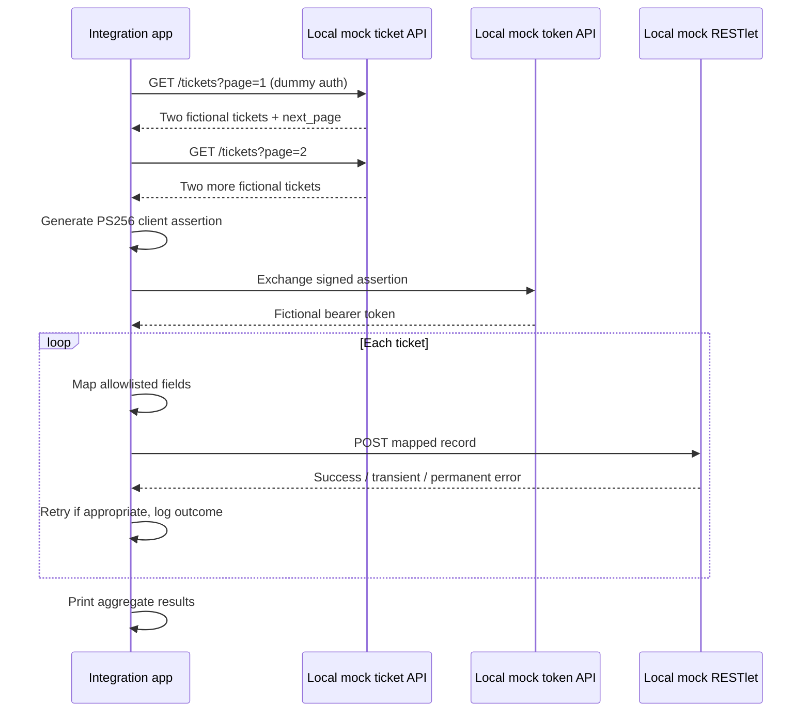

# Architecture, trade-offs and limitations

This local simulator was developed as an independent portfolio example. It does not contain original employer integration scripts or customer information.

## Sequence

## Security boundaries

- No secrets exist in committed files, and RSA keys are generated ephemerally in memory.
- No outbound connections to vendor services occur during the demo.
- Requests are deliberately restricted to the local server set up by the demonstration runner.
- Error logs include only fictional IDs, status codes and error types.
- Record mapping uses an allowlist rather than forwarding unreviewed customer data.

## Limitations and potential extensions

- Production APIs often use cursor pagination; this example intentionally demonstrates an easily testable next-page approach.
- Production NetSuite authentication must follow current vendor requirements; mock JWT claims are educational.
- Retries in this demo are short and deterministic. Production retries should use exponential backoff with jitter and `Retry-After` where applicable.
- Idempotency here is illustrated with a header. A real target must enforce idempotency or deduplication server-side.
- This demo starts fresh on each run. Production integrations need incremental synchronisation, checkpointing, dead-letter queues and alerting.
- Add metrics and integration-level monitoring before adapting for any real environment.
